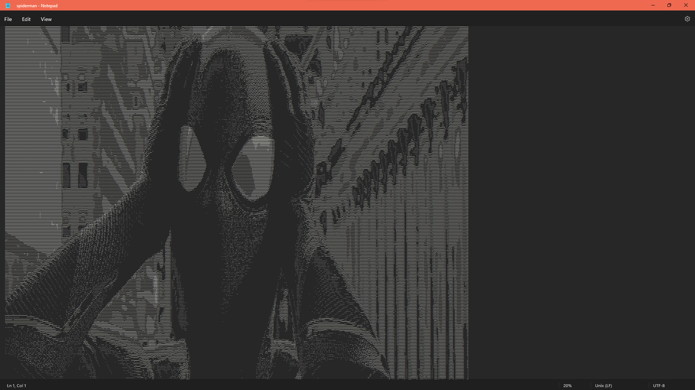

# ASCII art generator
Command line utility written as a ruby gem that loads an image from a given input path, transforms the image into an ASCII art and optionally applies filters.

The utility works as follows:
1. loads the image from given path
2. translates the image into ASCII art
3. optionally apply filters
4. outputs the ASCII art into the console or save to a given destination path

Here is an example:


## Instalation

### Dependencies

This project uses ImageMagick to extract pixel data from images. 

ImageMagick is included in a base repository of Debian-based systems. So simply use apt-get command:
```
sudo apt-get install imagemagick
```

ImageMagick is also part of standard Red Hat-based systems. Thus installation is straightforward with yum command:
```
sudo yum install ImageMagick
```

Installation of ImageMagick is straightforward on OpenSUSE with the use of zypper command:
```
sudo zypper install imagemagick
```

### Gem
After all dependencies are installed, you can build and install gem:
```
gem build ascii_gen.gemspec
gem install AsciiGen-0.1.0.gem
```

## Usage
Using gem
```
asciigen <command> <args>
```

Without gem
```
ruby bin/asciigen <command> <args>
```

### Commands
```
asciigen --convert, -c --source=SOURCE  # Convert the image from source path to ascii art.
asciigen --supported, -s                # Supported file extensions.
asciigen --version, -v                  # Print the version.
asciigen help [COMMAND]                 # Describe available commands or one specific command
```

## Tests
Run tests with the following command:
```
rspec spec
```

## Examples
Here are some example outputs of the utility, you can find them in /examples:
```
asciigen convert --source ./assets/spiderman.jpeg  --destination ./examples/spiderman.txt --scale 0.25 --brightness -50 --flip Y
asciigen convert --source ./assets/spongebob.jpg  --destination ./examples/spongebob.txt --rotate -90
asciigen convert --source ./assets/cvut.jpg  --destination ./examples/cvut.txt --invert
asciigen convert --source ./assets/progtest.png --destination ./examples/progtest.txt --scale 4
asciigen convert --source ./assets/ruby.png --destination ./examples/ruby.txt
```

To get a better view of the ASCII art, it is recomended to size down the font:

